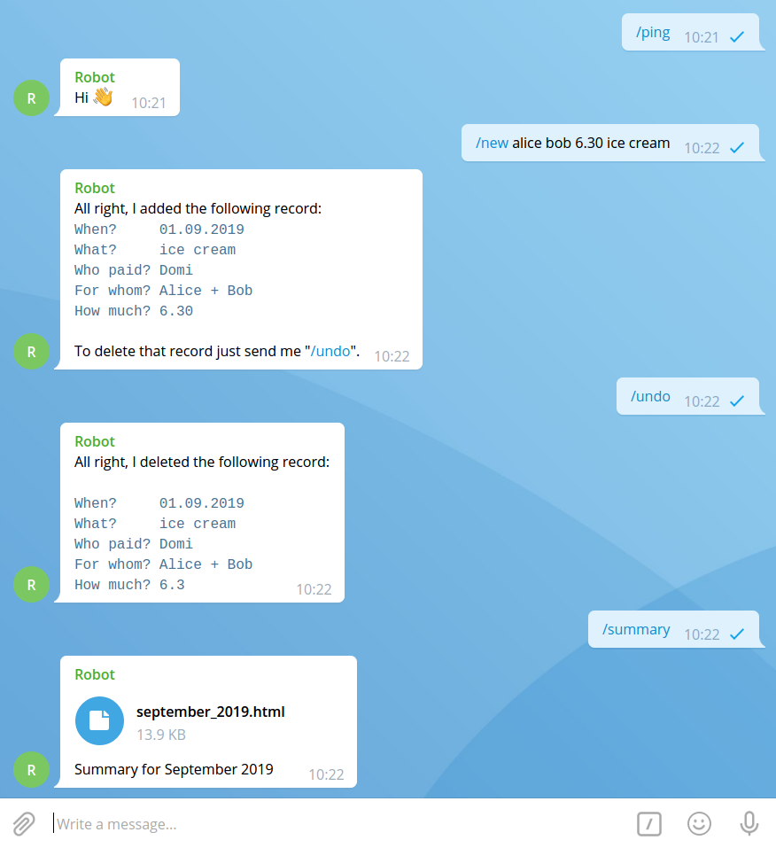

# Let me write that down for you

This application helps you manage your group's expenses via Telegram and Google Sheets. Just place a Telegram bot
in your Telegram group and send it commands to add or delete new entries as well as to automatically compute
summaries of all the expenses.

## Setup

1. Clone the repo and `cp config.template.json config.json` (will be filled in later). Run `pip install -r requirements.txt`.
2. Create a Google account and [activate the Google Sheets API (Step 1)](https://developers.google.com/sheets/api/quickstart/python).
   Download the `credentials.json` and save it to the project directory.
3. Create a spreadsheet at Google Sheets and copy the spreadsheet ID to `config.json -> "sheets.spreadsheet_id"`.
4. Create a sheet (table) within that spreadsheet and name it such that it corresponds to the format string at
   `json.config -> "sheets.table_name_format"` when using the current date (see below for more information about the naming);
   the default format is `%B %Y` which is `<Month as locale’s full name> <Year with century as a decimal number>`.
   Fill in the first row of that table with column names with the following meanings (the specific names are not
   important however their order is): `when, what, who_paid, for_whom, how_much`. This table serves as the template
   for the program to create new tables whenever a current accounting period starts (see below for more details).
5. [Create a Telegram Bot](https://core.telegram.org/bots#creating-a-new-bot) and update it to expose the following commands:
   `/new, /summary, /help`. Then place it in the Telegram group. Copy the bot's token to
   `config.json -> "telegram.token"`. Find out the group's chat id and copy it to `config.json -> "telegram.chat_id"`.
   You can find out the chat id by sending a message to the group and then fetching it similar to this
   [telepot example](https://telepot.readthedocs.io/en/latest/#receive-messages) or by running the app and observing the
   log output (it will contain an entry of the form `"Denied message from chat id <chat_id>"`). After you've entered the
   chat id in `config.json` the app will only accept messages from that group.
6. (Optional) Modify the other entries of `config.json` as appropriate (see below for more details).
7. Run the app via `python main.py`. A browser tab will open and you will be prompted to sign-in to your Google account.
   After that a warning will be displayed that an unverified app requests access to your Google Sheets data. Since this is
   your own app, you can safely proceed (see the [quickstart](https://developers.google.com/sheets/api/quickstart/python#this_app_isnt_verified)
   and [this article](https://support.google.com/cloud/answer/7454865) for more information). The app will store an
   access token on the disk (`token.pickle`) and so in the future you won't be prompted to sign-in anymore (only when that token expires).
8. That's it! Send `/help` to the Telegram group to check out what the bot can do or see below for more information.

## How does it work?

The app connects to the Google Sheets API and puts record in your spreadsheet as you send them. With `/new` you can add
new records using the following format:

    /new <for_whom> <how_much> <what>
    
where `<for_whom>` is a list of names (separated by `,` `+` or just whitespace) and `what` is an optional description.
If `what` contains a date of the form `DD.MM.YYYY` it will be taken as the date of the record, otherwise the current date is
used. The first name of the sender is used as `who_paid`. In order to use another name for specific persons, just fill in
`config.json -> "telegram.aliases"` which is a mapping of the form `first_name: alias`. If `how_much` is a negative number then
`for_whom` and `who_paid` are exchanged (this works only with a single person, since it is used in place of `who_paid`).
If `config.json -> "telegram.default_for_whom"` is filled in, then `for_whom` can be omitted and it will be filled with the value from the configuration (see below for details).

With `/undo` you can delete the most recently added record from the table. Previous records can't be deleted that way, 
`/undo` is only valid if it follows `/new` (not another `/undo`).

To receive a summary of the current accounting period, send `/summary`. You will receive an HTML file containing the summary.

At the end of the accounting period (these periods are determined by `config.json -> "sheets.table_name_format"`) a summary
is computed and sent to the group automatically. A new table for the next accounting period is created as well and the carryover is entered therein.
Optionally any records stored in `config.json -> "sheets.recurring_data"` will be added to the new table below the carryover.
These recurring data should be lists of the form `[what, who_paid, for_whom, how_much]`.
To compensate the carryover people should add a corresponding compensation record via `/new`.

If for some reason the new accounting period is not created automatically this can be requested manually via `/newperiod`.
This works starting from the first day of the month since it considers the current date to determine the period's table name.

### Accounting periods

An accounting period is determined by its name via `config.json -> "sheets.table_name_format"`. This format string is applied to
the current date and thus yields the name of the current accounting period. This name is used as the corresponding table name
in the Google spreadsheet. The end of an accounting period is determined by checking whether on the next day that format
string would yield a different name.

## Configuration

The following is an explanation of the configuration file:

    {
        "telegram": {
            "token": "< the token of the Telegram bot >",
            "chat_id": < the group's chat id (should be a negative number) >,
            "aliases": {
                < optional aliases mapping first names from Telegram (lowercase) to names that should be used in the sheet >
            },
            "lang": "en",  # language code for bot messages to the group
            "default_for_whom": {  # allows to leave out for_whom in messages; values are taken from this dict intead
                < Telegram first name (lowercase) > : < for_whom string which will be used for messages from that person >
            }
        },
        "sheets": {
            "scopes": ["https://www.googleapis.com/auth/spreadsheets"],
            "spreadsheet_id": "< the spreadsheet ID >",
            "recurring_data": [
                < this data will be added to the beginning of each new accounting period;
                  must be lists of the following form: [what, who_paid, for_whom, how_much] >
            ],
            "date_format": "%d.%m.%Y",  # date format within the spreadsheet
            "table_name_format": "%B %Y",  # date format for identifying accounting period (and thus table names)
            "undo_timer": 30,  # how many seconds until the most recent entry cannot be undone anymore
            "create_summary_at": "22:00",  # at the last day of the current accounting period, at this time, the summary will be created
            "lang": "en"  # language code for text entering the spreadsheet
        }
    }
